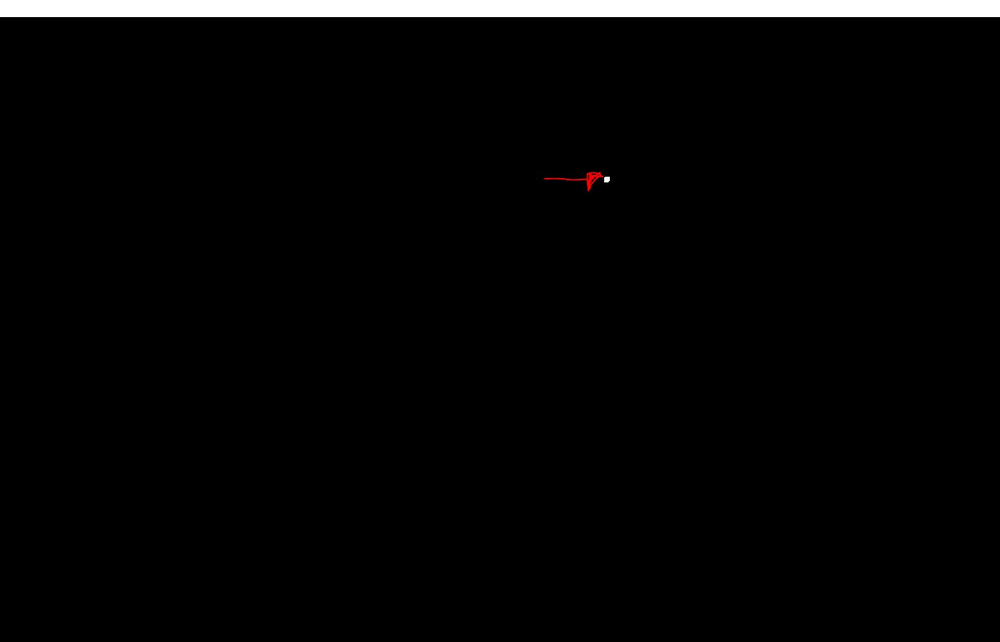
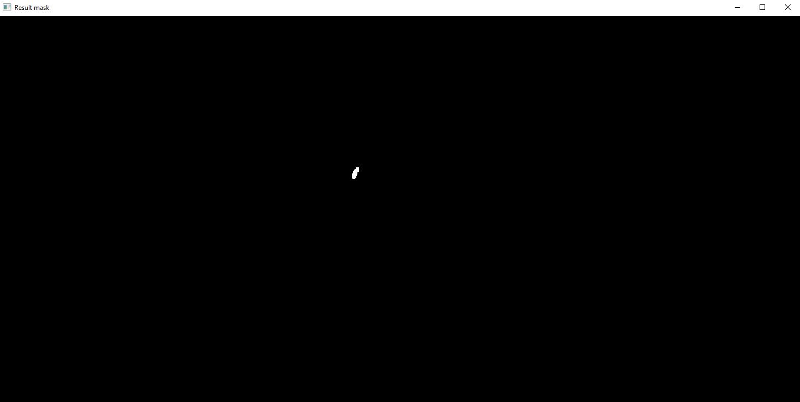
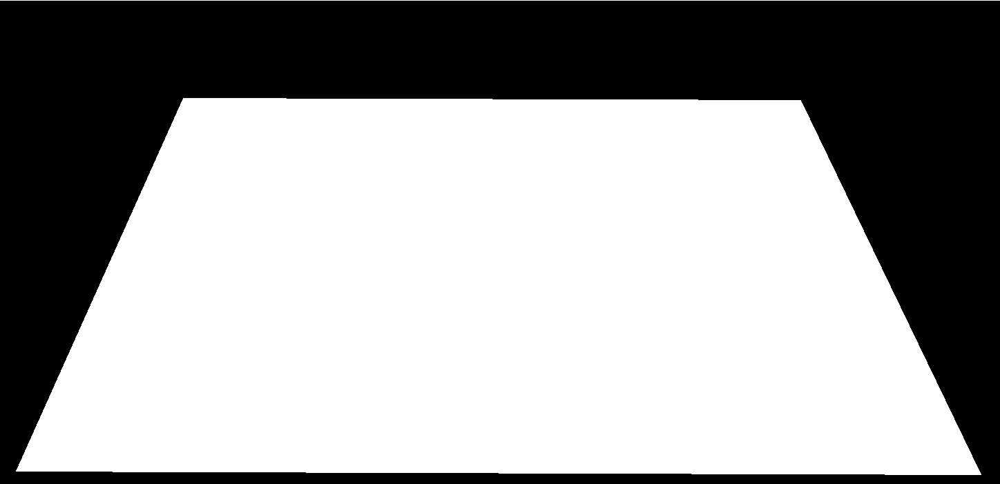

Mauricio Eduardo Negrete Rodríguez

Image, signal and video project.

The aim of the project is to track a tennis ball from a tennis match video and see whether the ball went inside or outside the court.

To achieve this, we focous on a ROI to avoid any possible noise brought from the video, since the camera position is static we define this space. Because we want to track the ball we create two mask, for this we initally apply a blur to the frame to avoid any other possible noise that's left out on the ROI. The first mask will track the movement of the ball using OpenCV to remove the background, erode and dilate our result frame.

Because we still have the players on our initial mask we filter out the players by HSV color, because of the point of view of the camera the ball size is inconsistent, meaning if the player is the closest to the camera the radius will be bigger, meanwhile if the ball is the farthest the ball radius will be smaller, because of this there are several thresholds defined to avoid filtering out the ball depending on which region it is. Also for this case, we erode and dilate our frame to filter the ball, but because of the same problem (the change on the ball size), we change the eroding iterations depending on where the ball currently is.

Close:

Far:

After this we just do an 'and' bitwise operation that give us the result mask of where the ball is located, we look up for the contours and keep the one with the maximum area.

For the position on the ball we also register the direction its heading towards, for this it uses some previous frames points we got to see the difference in the X and Y coordinates, which help us to keep track where is located and its position. Finally to detect if the ball went inside the court or not we define a region of the court, because the camera position is static and won't move we can define this region via a set of predefined points in our ROI.

To define if the ball bounced it would approximate the speed calculated the points that have been registered so far, from there it is defined that if there was a big change on the speed direction, the ball bounced off. We check with our previously defined court region if the ball went inside or not.

We add some visual aid to keep track of the ball and some data over the frame.

The end result is the following:

C:/Users/link5/anaconda3/python.exe c:/Users/link5/Documents/SideProjects/AI/Images/main.py --video C:/Users/link5/Documents/SideProjects/AI/Images/tennis_match.mp4
